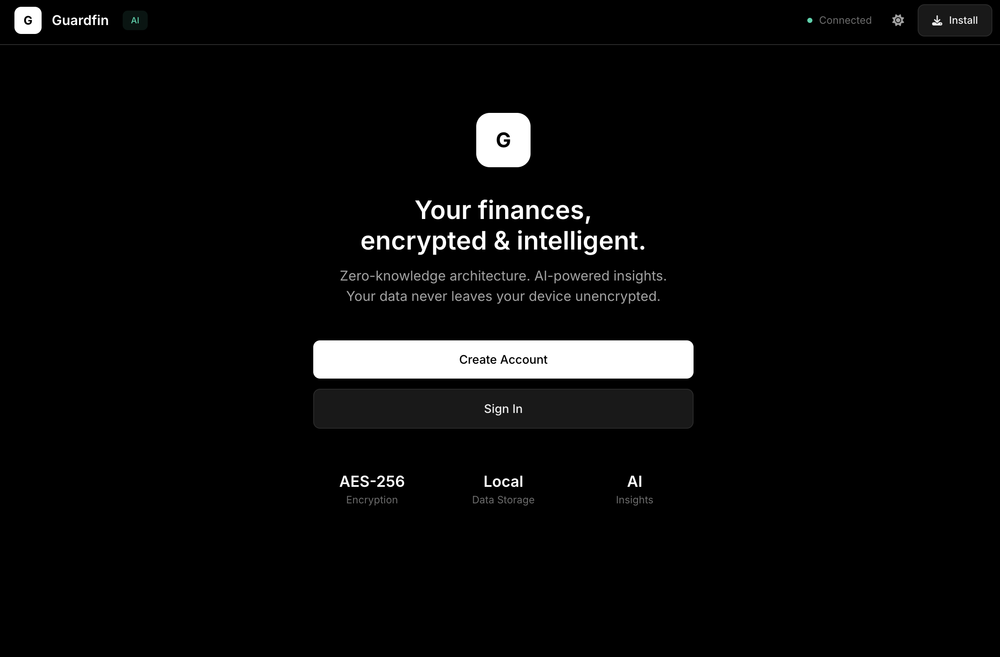

# Guardfin

A financial planning application with client-side encryption and AI assistance. All data is encrypted locally before any network transmission.



---

## Overview

Guardfin tracks expenses, budgets, and savings goals while keeping your financial data private. The application encrypts everything in your browser using AES-256-GCM before storing or syncing. The server only sees encrypted blobs it cannot read.

The AI assistant helps with natural language input ("add $50 for groceries") and provides spending insights without accessing raw financial data.

Guardfin is a Progressive Web App - install it directly from your browser for offline access and a native app experience.

## Setup

**Requirements:** Node.js 16+, Gemini API key (optional, for AI features)

```bash
cd server
npm install

# Copy example config and add your Gemini API key
cp server-config.example.json server-config.json
# Edit server-config.json with your API key (optional, for AI features)

npm start
```

Open `client/index.html` in a browser, or use VS Code Live Server for local development.

## Features

**Transactions**
- Natural language input, manual entry, CSV import
- Search and filter by category, type, date
- Export to CSV

**Budgets**
- Monthly limits per category
- Visual progress tracking

**Goals**
- Savings targets with deadlines
- Progress tracking

**AI Assistant**
- Conversational transaction entry
- Spending analysis and predictions
- Budget and goal management through chat

## Security

- AES-256-GCM encryption with PBKDF2 key derivation (250k iterations)
- Zero-knowledge server architecture
- No passwords stored, only verification hashes
- AI receives anonymized summaries only

## Structure

```
client/
  index.html    # UI and styles
  app.js        # Application logic, encryption
server/
  server.js     # API, AI integration
  server-config.json
```

## Keyboard Shortcuts

| Key | Action |
|-----|--------|
| N | Quick add |
| / | Search |
| T | Toggle theme |
| 1-5 | Switch tabs |

## API

| Endpoint | Description |
|----------|-------------|
| GET /api/health | Status check |
| POST /api/sync | Sync encrypted data |
| POST /api/agent/chat | AI conversation |
| POST /api/agent/insights | Generate insights |

## Troubleshooting

**AI not responding:** Check Gemini API key in server-config.json and ensure server is running.

**CORS errors:** Add your origin to `allowedOrigins` in server-config.json.

**Forgot passphrase:** Data cannot be recovered. This is intentional.

**This app is still under development, so there might be some bugs. I’m fixing things as they come up -- feel free to email me if you spot anything!**
